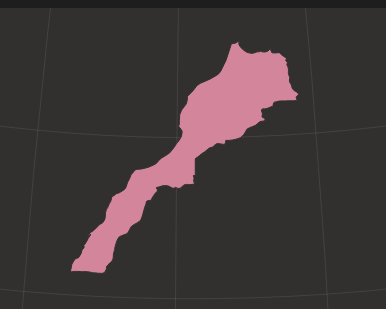
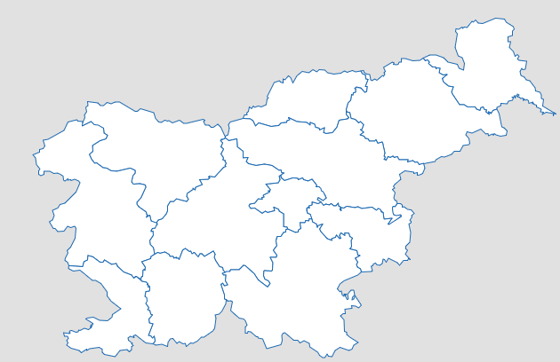

# Obcinko

## Main mechanics:

- guess corect obcina of the DAY == WIN
- 5 tries == LOSE

## Tries:

1. Guess
2. Outline
3. Region
4. Neighbouring municipalities
5. Map with highlighted obcina

## Regije

- https://www.stat.si/obcine/sl
- Obcino poiscem v datoteki in berem regijo

## Ideas:

- Satelite? 
- game mode click obcina

## Problems:

- kaj ko se vse obcina napisane ? (archive bo isto --> vedno drugi podakti =????? idk) (worlde archive)

## Features later on ? :

- buy me coffee
- archive
- duolingo like streak???? win streak
- popup keyboard
- localization
- bonous rounds like worldle ?
- statistics
- game modes (only x region?)
- SEO !!! EZ PIKE 

## Dodaj do 2. konzultacije

- vse namige
- reward za completion odvisn od namigov
- satelit